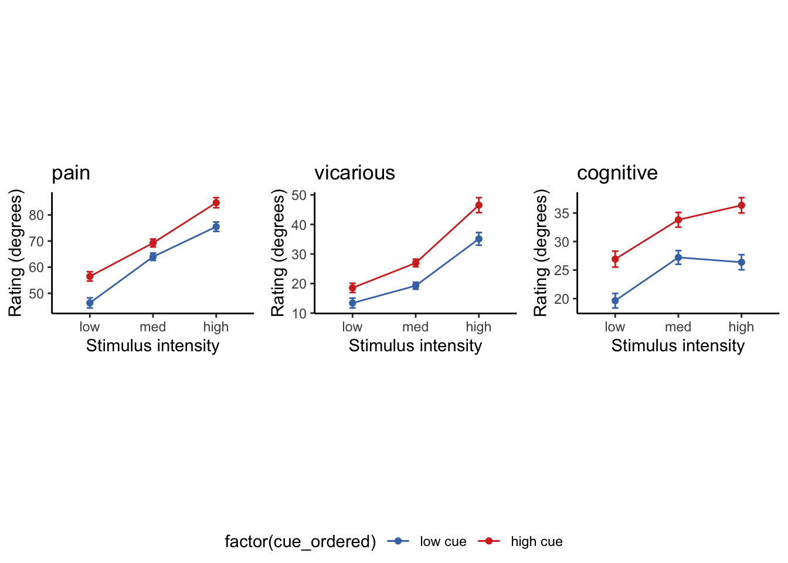

# [beh] outcome_rating ~ cue * stim {#ch05_outcome-cueXstim}

## What is the purpose of this notebook? {.unlisted .unnumbered}

Here, I plot the outcome ratings as a function of cue and stimulus intensity. 

* Main model: `lmer(outcome_rating ~ cue * stim)` 
* Main question: do outcome ratings differ as a function of cue type and stimulus intensity? 
* If there is a main effect of cue on outcome ratings, does this cue effect differ depending on task type?
* Is there an interaction between the two factors?
* IV: 
  - cue (high / low)
  - stim (high / med / low)
* DV: outcome rating

## model 03 iv-cuecontrast dv-actual

### model 03 3-2. individual difference

### model 04 iv-cue-stim dv-actual

### model 04 4-2 individual differences in cue effects

### model 04 4-3 scatter plot

### model 04 4-4 lineplot

