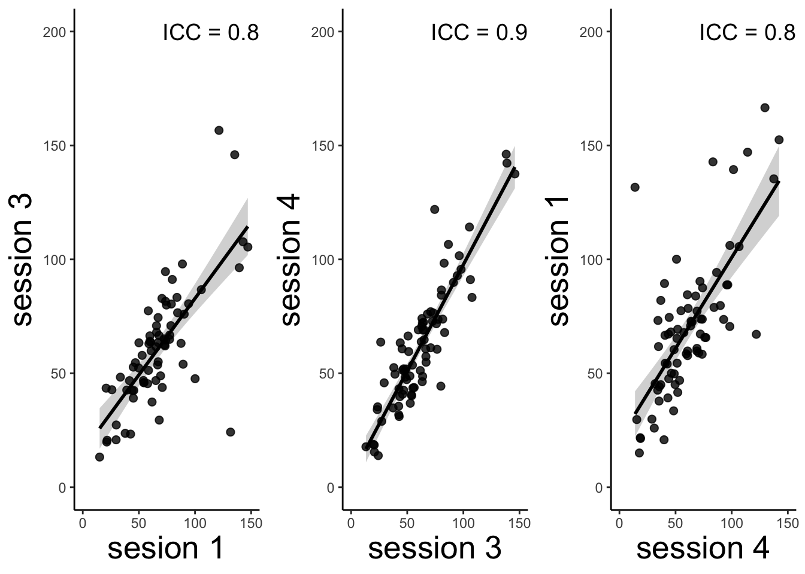
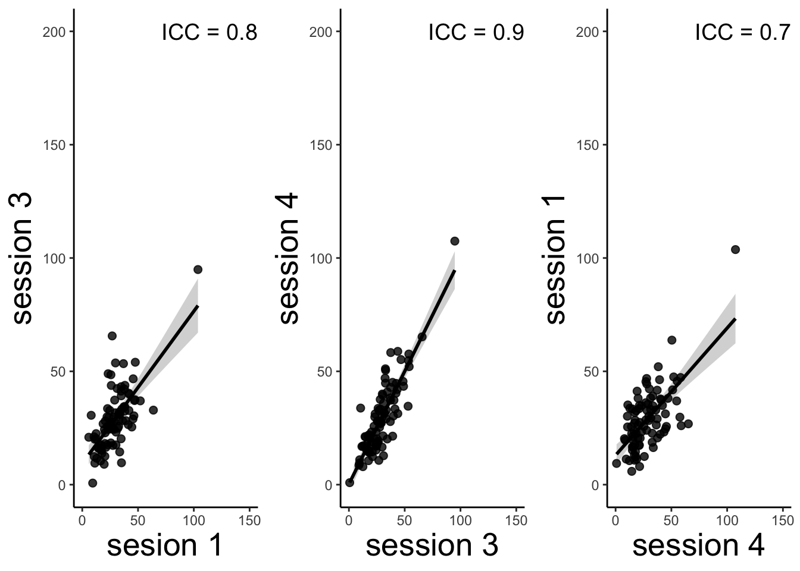

# [beh] outcome_rating ~ session ("behavioral ICC") {#ch10_icc}

---
title: "behavioral_ICC"
author: "Heejung Jung"
date: "2/22/2022"
output: html_document
---


## Functions


http://www.cookbook-r.com/Graphs/Plotting_means_and_error_bars_(ggplot2)/#Helper%20functions


combined expect_df / run_cue_lmer / meanSummary / plot_expect_rainclouds


```r
raincloud_theme = theme(
text = element_text(size = 10),
axis.title.x = element_text(size = 16),
axis.title.y = element_text(size = 16),
axis.text = element_text(size = 14),
axis.text.x = element_text(angle = 45, vjust = 0.5),
legend.title=element_text(size=16),
legend.text=element_text(size=16),
legend.position = "right",
plot.title = element_text(lineheight=.8, face="bold", size = 16),
panel.border = element_blank(),
panel.grid.minor = element_blank(),
panel.grid.major = element_blank(),
axis.line.x = element_line(colour = 'black', size=0.5, linetype='solid'),
axis.line.y = element_line(colour = 'black', size=0.5, linetype='solid'))
```

```
## Warning: The `size` argument of `element_line()` is deprecated as of ggplot2 3.4.0.
## ℹ Please use the `linewidth` argument instead.
```

```r
w = 5
h = 3
```


```r
# subjectwise = meanSummary(DF, c(src_subject_id, session_id), event04_actual_angle)
# groupwise = summarySEwithin(data=subjectwise, 
#                   measurevar = "mean_per_sub", # variable created from above
#                     withinvars = c(IV), # IV
#                     idvar = "subject")
# 
main_dir = '/Users/h/Dropbox/projects_dropbox/social_influence_analysis'
for (TASKNAME in c("pain","vicarious","cognitive")){
  print(TASKNAME)
  DV_KEYWORD = "actual-rating"
FILENAME = paste('*_task-social_*-' ,TASKNAME, '_beh.csv', sep = "")
common_path = Sys.glob(file.path(main_dir,'data', 'beh', 'beh02_preproc', 'sub-*','ses-*',FILENAME))
filter_path = common_path[!str_detect(common_path,pattern="sub-0001|sub-0003|sub-0004|sub-0005|sub-0025")]

DF <- do.call("rbind",lapply(filter_path,FUN=function(files){ read.csv(files)}))
is.nan.data.frame <- function(x)
  do.call(cbind, lapply(x, is.nan))
DF[is.nan(DF)] <- NA
DF = as.data.frame(DF)
# subjects as factor
DF$subject = factor(DF$src_subject_id)
SUBJECT = "src_subject_id"
IV = "session_id"
DV = "event04_actual_angle"
DF[is.nan(DF)]<-NA
subjectwise_ses = meanSummary(DF, c("subject", IV), DV)
subjectwise_ses[is.nan(subjectwise_ses)]<-NA

# long to wide

ses_beh = subset(subjectwise_ses,select = c("subject", "session_id", "mean_per_sub"))
ses_beh[is.nan(ses_beh)]<-NA
ses_beh_wide = reshape(ses_beh, idvar = "subject", timevar = "session_id", direction = "wide")
sub_ses = ses_beh_wide[rowSums(is.na(ses_beh_wide[,-1])) != ncol(ses_beh_wide[,-1]), ]
sub_13 = sub_ses[,c("mean_per_sub.1", "mean_per_sub.3")]
c13 = psych::ICC(sub_13[complete.cases(sub_13),])
icc13 = irr::icc(
  sub_13[complete.cases(sub_13),], model = "twoway", 
  type = "agreement", unit = "average"
  )
icc13_text = c13$results$ICC[5]# icc13_text = c13$results$ICC[5]

c34 = psych::ICC(sub_ses[,c("mean_per_sub.3", "mean_per_sub.4")])
icc34 = irr::icc(
  sub_ses[,c("mean_per_sub.3", "mean_per_sub.4")], model = "twoway", 
  type = "agreement", unit = "average"
  )
icc34_text = c34$results$ICC[5]

c41 = psych::ICC(sub_ses[,c("mean_per_sub.4", "mean_per_sub.1")])
ses41 = irr::icc(
  sub_ses[,c("mean_per_sub.4", "mean_per_sub.1")], model = "twoway", 
  type = "agreement", unit = "average"
  )
icc41_text = c41$results$ICC[5]

beh13 = ggplot(data = sub_ses, aes(x = mean_per_sub.1, y = mean_per_sub.3)) +
  stat_smooth(method = 'lm', color = "black") + 
  geom_point(size = 2, alpha = .8) +
  xlab("sesion 1") + ylab("session 3") + xlim(0, 150) + ylim(0, 200) +
  theme_classic() +
  theme(axis.title = element_text(size = 20))  +
    annotate(geom = "text", x = 120, y = 200, 
           label = as.character(paste("ICC = ",format(icc13_text, digits = 2),sep = "")),
           color = "black", size = 5)

beh34 = ggplot(data = sub_ses, aes(x = mean_per_sub.3, y = mean_per_sub.4)) +
  stat_smooth(method = 'lm', color = "black") + 
  geom_point(size = 2, alpha = .8) +
  xlab("session 3") + ylab("session 4") + xlim(0, 150) + ylim(0, 200) +
  theme_classic() +
  theme(axis.title = element_text(size = 20))  +
    annotate(geom = "text", x = 120, y = 200, 
           label = as.character(paste("ICC = ",format(icc34_text, digits = 2),sep = "")),
           color = "black", size = 5)

beh41 = ggplot(data = sub_ses, aes(x = mean_per_sub.4, y = mean_per_sub.1)) +
  stat_smooth(method = 'lm', color = "black") + 
  geom_point(size = 2, alpha = .8) +
  xlab("session 4") + ylab("session 1") + xlim(0, 150) + ylim(0, 200) +
  theme_classic() + 
  theme(axis.title = element_text(size = 20))  +
  annotate(geom = "text", x = 120, y = 200, 
           label = as.character(paste("ICC = ",format(icc41_text, digits = 2),sep = "")),
           color = "black", size = 5)


g<-ggpubr::ggarrange(beh13,beh34,beh41,ncol = 3, nrow = 1, common.legend = FALSE,legend = "bottom")
print(g)
plot_filename = file.path(main_dir, 'analysis','mixedeffect','model04_behavioral-ICC', paste('socialinfluence_task-',TASKNAME,'_',DV_KEYWORD,'_icc','_', as.character(Sys.Date()),'.png', sep = ""))
ggsave(plot_filename, width = 10, height = 3)
}
```

```
## [1] "pain"
```

```
## boundary (singular) fit: see help('isSingular')
```

```
## `geom_smooth()` using formula = 'y ~ x'
```

```
## Warning: Removed 38 rows containing non-finite values (`stat_smooth()`).
```

```
## Warning: Removed 38 rows containing missing values (`geom_point()`).
```

```
## `geom_smooth()` using formula = 'y ~ x'
```

```
## Warning: Removed 32 rows containing non-finite values (`stat_smooth()`).
```

```
## Warning: Removed 32 rows containing missing values (`geom_point()`).
```

```
## `geom_smooth()` using formula = 'y ~ x'
```

```
## Warning: Removed 35 rows containing non-finite values (`stat_smooth()`).
```

```
## Warning: Removed 35 rows containing missing values (`geom_point()`).
```

```
## [1] "vicarious"
```

```
## `geom_smooth()` using formula = 'y ~ x'
```

```
## Warning: Removed 22 rows containing non-finite values (`stat_smooth()`).
```

```
## Warning: Removed 22 rows containing missing values (`geom_point()`).
```

```
## `geom_smooth()` using formula = 'y ~ x'
```

```
## Warning: Removed 18 rows containing non-finite values (`stat_smooth()`).
```

```
## Warning: Removed 18 rows containing missing values (`geom_point()`).
```

```
## `geom_smooth()` using formula = 'y ~ x'
```

```
## Warning: Removed 21 rows containing non-finite values (`stat_smooth()`).
```

```
## Warning: Removed 21 rows containing missing values (`geom_point()`).
```



```
## [1] "cognitive"
```

```
## boundary (singular) fit: see help('isSingular')
```

```
## Warning in checkConv(attr(opt, "derivs"), opt$par, ctrl = control$checkConv, :
## Model failed to converge with max|grad| = 0.00281869 (tol = 0.002, component 1)
```

```
## boundary (singular) fit: see help('isSingular')
## `geom_smooth()` using formula = 'y ~ x'
```

```
## Warning: Removed 22 rows containing non-finite values (`stat_smooth()`).
```

```
## Warning: Removed 22 rows containing missing values (`geom_point()`).
```

```
## `geom_smooth()` using formula = 'y ~ x'
```

```
## Warning: Removed 17 rows containing non-finite values (`stat_smooth()`).
```

```
## Warning: Removed 17 rows containing missing values (`geom_point()`).
```

```
## `geom_smooth()` using formula = 'y ~ x'
```

```
## Warning: Removed 20 rows containing non-finite values (`stat_smooth()`).
```

```
## Warning: Removed 20 rows containing missing values (`geom_point()`).
```




## TODO:
* calculate average rating per session across participants
* row: sub-num
* columns: ses 1,3,4
* calculate 
