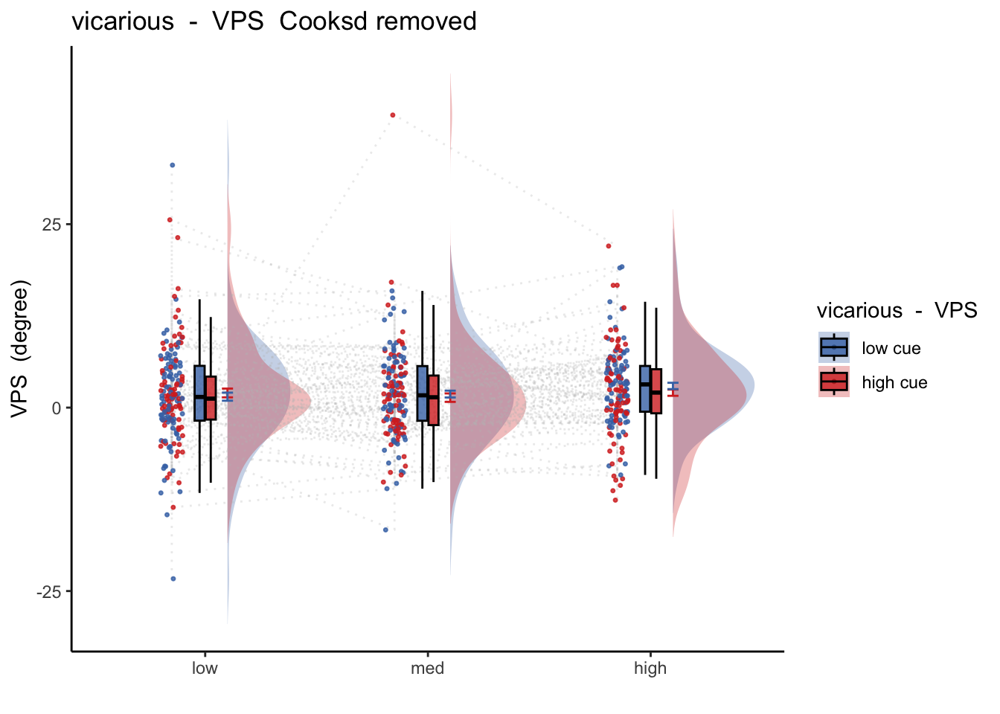

# [fMRI] VPS ~ singletrial {#ch36_singletrial_V}

```
author: "Heejung Jung
date: "2023-03-23"
```

## What is the purpose of this notebook? {.unlisted .unnumbered}

* Here, I model vPS dot products as a function of cue, stimulus intensity and expectation ratings. 
* One of the findings is that low cues lead to higher VPS dotproducts in the high intensity group, and that this effect becomes non-significant across sessions. 
* 03/23/2023: For now, I'm grabbing participants that have complete data, i.e. 18 runs, all three sessions. N = 65


```
## [1] "/Users/h/Dropbox (Dartmouth College)/projects_dropbox/social_influence_analysis/analysis/fmri/nilearn/signature_extract/signature-VPS_sub-all_runtype-pvc_event-stimulus.tsv"
```


---

## VPS ~ 3 task * 3 stimulus_intensity
### Q. What does the VPS pattern look like for the three tasks? {.unlisted .unnumbered}


```r
model.alltask <-
  lmer(VPS ~ task_con_linear*stim_factor + 
         task_con_quad*stim_factor + (task|sub), data = pvc)
sjPlot::tab_model(model.alltask)
```

<table style="border-collapse:collapse; border:none;">
<tr>
<th style="border-top: double; text-align:center; font-style:normal; font-weight:bold; padding:0.2cm;  text-align:left; ">&nbsp;</th>
<th colspan="3" style="border-top: double; text-align:center; font-style:normal; font-weight:bold; padding:0.2cm; ">VPS</th>
</tr>
<tr>
<td style=" text-align:center; border-bottom:1px solid; font-style:italic; font-weight:normal;  text-align:left; ">Predictors</td>
<td style=" text-align:center; border-bottom:1px solid; font-style:italic; font-weight:normal;  ">Estimates</td>
<td style=" text-align:center; border-bottom:1px solid; font-style:italic; font-weight:normal;  ">CI</td>
<td style=" text-align:center; border-bottom:1px solid; font-style:italic; font-weight:normal;  ">p</td>
</tr>
<tr>
<td style=" padding:0.2cm; text-align:left; vertical-align:top; text-align:left; ">(Intercept)</td>
<td style=" padding:0.2cm; text-align:left; vertical-align:top; text-align:center;  ">1.24</td>
<td style=" padding:0.2cm; text-align:left; vertical-align:top; text-align:center;  ">0.65&nbsp;&ndash;&nbsp;1.83</td>
<td style=" padding:0.2cm; text-align:left; vertical-align:top; text-align:center;  "><strong>&lt;0.001</strong></td>
</tr>
<tr>
<td style=" padding:0.2cm; text-align:left; vertical-align:top; text-align:left; ">task con linear</td>
<td style=" padding:0.2cm; text-align:left; vertical-align:top; text-align:center;  ">&#45;5.30</td>
<td style=" padding:0.2cm; text-align:left; vertical-align:top; text-align:center;  ">&#45;7.15&nbsp;&ndash;&nbsp;-3.46</td>
<td style=" padding:0.2cm; text-align:left; vertical-align:top; text-align:center;  "><strong>&lt;0.001</strong></td>
</tr>
<tr>
<td style=" padding:0.2cm; text-align:left; vertical-align:top; text-align:left; ">stim factor [low]</td>
<td style=" padding:0.2cm; text-align:left; vertical-align:top; text-align:center;  ">0.29</td>
<td style=" padding:0.2cm; text-align:left; vertical-align:top; text-align:center;  ">&#45;0.01&nbsp;&ndash;&nbsp;0.59</td>
<td style=" padding:0.2cm; text-align:left; vertical-align:top; text-align:center;  ">0.056</td>
</tr>
<tr>
<td style=" padding:0.2cm; text-align:left; vertical-align:top; text-align:left; ">stim factor [med]</td>
<td style=" padding:0.2cm; text-align:left; vertical-align:top; text-align:center;  ">0.23</td>
<td style=" padding:0.2cm; text-align:left; vertical-align:top; text-align:center;  ">&#45;0.07&nbsp;&ndash;&nbsp;0.53</td>
<td style=" padding:0.2cm; text-align:left; vertical-align:top; text-align:center;  ">0.136</td>
</tr>
<tr>
<td style=" padding:0.2cm; text-align:left; vertical-align:top; text-align:left; ">task con quad</td>
<td style=" padding:0.2cm; text-align:left; vertical-align:top; text-align:center;  ">&#45;2.11</td>
<td style=" padding:0.2cm; text-align:left; vertical-align:top; text-align:center;  ">&#45;3.90&nbsp;&ndash;&nbsp;-0.32</td>
<td style=" padding:0.2cm; text-align:left; vertical-align:top; text-align:center;  "><strong>0.021</strong></td>
</tr>
<tr>
<td style=" padding:0.2cm; text-align:left; vertical-align:top; text-align:left; ">task con linear * stim<br>factor [low]</td>
<td style=" padding:0.2cm; text-align:left; vertical-align:top; text-align:center;  ">&#45;0.59</td>
<td style=" padding:0.2cm; text-align:left; vertical-align:top; text-align:center;  ">&#45;2.02&nbsp;&ndash;&nbsp;0.84</td>
<td style=" padding:0.2cm; text-align:left; vertical-align:top; text-align:center;  ">0.421</td>
</tr>
<tr>
<td style=" padding:0.2cm; text-align:left; vertical-align:top; text-align:left; ">task con linear * stim<br>factor [med]</td>
<td style=" padding:0.2cm; text-align:left; vertical-align:top; text-align:center;  ">&#45;1.54</td>
<td style=" padding:0.2cm; text-align:left; vertical-align:top; text-align:center;  ">&#45;2.98&nbsp;&ndash;&nbsp;-0.11</td>
<td style=" padding:0.2cm; text-align:left; vertical-align:top; text-align:center;  "><strong>0.035</strong></td>
</tr>
<tr>
<td style=" padding:0.2cm; text-align:left; vertical-align:top; text-align:left; ">stim factor [low] * task<br>con quad</td>
<td style=" padding:0.2cm; text-align:left; vertical-align:top; text-align:center;  ">2.61</td>
<td style=" padding:0.2cm; text-align:left; vertical-align:top; text-align:center;  ">1.36&nbsp;&ndash;&nbsp;3.87</td>
<td style=" padding:0.2cm; text-align:left; vertical-align:top; text-align:center;  "><strong>&lt;0.001</strong></td>
</tr>
<tr>
<td style=" padding:0.2cm; text-align:left; vertical-align:top; text-align:left; ">stim factor [med] * task<br>con quad</td>
<td style=" padding:0.2cm; text-align:left; vertical-align:top; text-align:center;  ">2.21</td>
<td style=" padding:0.2cm; text-align:left; vertical-align:top; text-align:center;  ">0.96&nbsp;&ndash;&nbsp;3.46</td>
<td style=" padding:0.2cm; text-align:left; vertical-align:top; text-align:center;  "><strong>0.001</strong></td>
</tr>
<tr>
<td colspan="4" style="font-weight:bold; text-align:left; padding-top:.8em;">Random Effects</td>
</tr>

<tr>
<td style=" padding:0.2cm; text-align:left; vertical-align:top; text-align:left; padding-top:0.1cm; padding-bottom:0.1cm;">&sigma;<sup>2</sup></td>
<td style=" padding:0.2cm; text-align:left; vertical-align:top; padding-top:0.1cm; padding-bottom:0.1cm; text-align:left;" colspan="3">74.67</td>
</tr>

<tr>
<td style=" padding:0.2cm; text-align:left; vertical-align:top; text-align:left; padding-top:0.1cm; padding-bottom:0.1cm;">&tau;<sub>00</sub> <sub>sub</sub></td>
<td style=" padding:0.2cm; text-align:left; vertical-align:top; padding-top:0.1cm; padding-bottom:0.1cm; text-align:left;" colspan="3">16.59</td>

<tr>
<td style=" padding:0.2cm; text-align:left; vertical-align:top; text-align:left; padding-top:0.1cm; padding-bottom:0.1cm;">&tau;<sub>11</sub> <sub>sub.taskpain</sub></td>
<td style=" padding:0.2cm; text-align:left; vertical-align:top; padding-top:0.1cm; padding-bottom:0.1cm; text-align:left;" colspan="3">35.89</td>

<tr>
<td style=" padding:0.2cm; text-align:left; vertical-align:top; text-align:left; padding-top:0.1cm; padding-bottom:0.1cm;">&tau;<sub>11</sub> <sub>sub.taskvicarious</sub></td>
<td style=" padding:0.2cm; text-align:left; vertical-align:top; padding-top:0.1cm; padding-bottom:0.1cm; text-align:left;" colspan="3">16.74</td>

<tr>
<td style=" padding:0.2cm; text-align:left; vertical-align:top; text-align:left; padding-top:0.1cm; padding-bottom:0.1cm;">&rho;<sub>01</sub></td>
<td style=" padding:0.2cm; text-align:left; vertical-align:top; padding-top:0.1cm; padding-bottom:0.1cm; text-align:left;" colspan="3">-0.51</td>

<tr>
<td style=" padding:0.2cm; text-align:left; vertical-align:top; text-align:left; padding-top:0.1cm; padding-bottom:0.1cm;"></td>
<td style=" padding:0.2cm; text-align:left; vertical-align:top; padding-top:0.1cm; padding-bottom:0.1cm; text-align:left;" colspan="3">-0.68</td>

<tr>
<td style=" padding:0.2cm; text-align:left; vertical-align:top; text-align:left; padding-top:0.1cm; padding-bottom:0.1cm;">ICC</td>
<td style=" padding:0.2cm; text-align:left; vertical-align:top; padding-top:0.1cm; padding-bottom:0.1cm; text-align:left;" colspan="3">0.18</td>

<tr>
<td style=" padding:0.2cm; text-align:left; vertical-align:top; text-align:left; padding-top:0.1cm; padding-bottom:0.1cm;">N <sub>sub</sub></td>
<td style=" padding:0.2cm; text-align:left; vertical-align:top; padding-top:0.1cm; padding-bottom:0.1cm; text-align:left;" colspan="3">111</td>
<tr>
<td style=" padding:0.2cm; text-align:left; vertical-align:top; text-align:left; padding-top:0.1cm; padding-bottom:0.1cm; border-top:1px solid;">Observations</td>
<td style=" padding:0.2cm; text-align:left; vertical-align:top; padding-top:0.1cm; padding-bottom:0.1cm; text-align:left; border-top:1px solid;" colspan="3">19428</td>
</tr>
<tr>
<td style=" padding:0.2cm; text-align:left; vertical-align:top; text-align:left; padding-top:0.1cm; padding-bottom:0.1cm;">Marginal R<sup>2</sup> / Conditional R<sup>2</sup></td>
<td style=" padding:0.2cm; text-align:left; vertical-align:top; padding-top:0.1cm; padding-bottom:0.1cm; text-align:left;" colspan="3">0.072 / 0.241</td>
</tr>

</table>

#### eta-squared {.unlisted .unnumbered}
<table class="table table-striped" style="font-size: 12px; ">
 <thead>
  <tr>
   <th style="text-align:left;"> Parameter </th>
   <th style="text-align:right;"> Eta2_partial </th>
   <th style="text-align:right;"> CI </th>
   <th style="text-align:right;"> CI_low </th>
   <th style="text-align:right;"> CI_high </th>
  </tr>
 </thead>
<tbody>
  <tr>
   <td style="text-align:left;"> task_con_linear </td>
   <td style="text-align:right;"> 0.3266266 </td>
   <td style="text-align:right;"> 0.95 </td>
   <td style="text-align:right;"> 0.2104200 </td>
   <td style="text-align:right;"> 1 </td>
  </tr>
  <tr>
   <td style="text-align:left;"> stim_factor </td>
   <td style="text-align:right;"> 0.0002117 </td>
   <td style="text-align:right;"> 0.95 </td>
   <td style="text-align:right;"> 0.0000000 </td>
   <td style="text-align:right;"> 1 </td>
  </tr>
  <tr>
   <td style="text-align:left;"> task_con_quad </td>
   <td style="text-align:right;"> 0.0034213 </td>
   <td style="text-align:right;"> 0.95 </td>
   <td style="text-align:right;"> 0.0000000 </td>
   <td style="text-align:right;"> 1 </td>
  </tr>
  <tr>
   <td style="text-align:left;"> task_con_linear:stim_factor </td>
   <td style="text-align:right;"> 0.0002379 </td>
   <td style="text-align:right;"> 0.95 </td>
   <td style="text-align:right;"> 0.0000000 </td>
   <td style="text-align:right;"> 1 </td>
  </tr>
  <tr>
   <td style="text-align:left;"> stim_factor:task_con_quad </td>
   <td style="text-align:right;"> 0.0010135 </td>
   <td style="text-align:right;"> 0.95 </td>
   <td style="text-align:right;"> 0.0003561 </td>
   <td style="text-align:right;"> 1 </td>
  </tr>
</tbody>
</table>

#### Cohen's d {.unlisted .unnumbered}
<table class="table table-striped" style="font-size: 12px; ">
 <thead>
  <tr>
   <th style="text-align:left;">   </th>
   <th style="text-align:right;"> t </th>
   <th style="text-align:right;"> df </th>
   <th style="text-align:right;"> d </th>
  </tr>
 </thead>
<tbody>
  <tr>
   <td style="text-align:left;"> task_con_linear </td>
   <td style="text-align:right;"> -5.6291153 </td>
   <td style="text-align:right;"> 164.6488 </td>
   <td style="text-align:right;"> -0.8773863 </td>
  </tr>
  <tr>
   <td style="text-align:left;"> stim_factorlow </td>
   <td style="text-align:right;"> 1.9136684 </td>
   <td style="text-align:right;"> 19090.4418 </td>
   <td style="text-align:right;"> 0.0277006 </td>
  </tr>
  <tr>
   <td style="text-align:left;"> stim_factormed </td>
   <td style="text-align:right;"> 1.4905241 </td>
   <td style="text-align:right;"> 19090.4418 </td>
   <td style="text-align:right;"> 0.0215755 </td>
  </tr>
  <tr>
   <td style="text-align:left;"> task_con_quad </td>
   <td style="text-align:right;"> -2.3069934 </td>
   <td style="text-align:right;"> 148.6413 </td>
   <td style="text-align:right;"> -0.3784483 </td>
  </tr>
  <tr>
   <td style="text-align:left;"> task_con_linear:stim_factorlow </td>
   <td style="text-align:right;"> -0.8050546 </td>
   <td style="text-align:right;"> 19090.4422 </td>
   <td style="text-align:right;"> -0.0116533 </td>
  </tr>
  <tr>
   <td style="text-align:left;"> task_con_linear:stim_factormed </td>
   <td style="text-align:right;"> -2.1116090 </td>
   <td style="text-align:right;"> 19090.4422 </td>
   <td style="text-align:right;"> -0.0305658 </td>
  </tr>
  <tr>
   <td style="text-align:left;"> stim_factorlow:task_con_quad </td>
   <td style="text-align:right;"> 4.0883679 </td>
   <td style="text-align:right;"> 19090.4422 </td>
   <td style="text-align:right;"> 0.0591796 </td>
  </tr>
  <tr>
   <td style="text-align:left;"> stim_factormed:task_con_quad </td>
   <td style="text-align:right;"> 3.4549197 </td>
   <td style="text-align:right;"> 19090.4422 </td>
   <td style="text-align:right;"> 0.0500104 </td>
  </tr>
</tbody>
</table>


## VPS ~ vicarious task: 2 cue x 3 stimulus_intensity

### Q. Within vicarious task, Does stimulus intenisty level and cue level significantly predict VPS dotproducts? {.unlisted .unnumbered}


### Linear model ver 1: VPS ~ stimulus_intensity

```r
model.vpsstim <- lmer(VPS ~ stim_con_linear + stim_con_quad +(stim_con_linear + stim_con_quad |sub), data = data_screen)
sjPlot::tab_model(model.vpsstim)
```

<table style="border-collapse:collapse; border:none;">
<tr>
<th style="border-top: double; text-align:center; font-style:normal; font-weight:bold; padding:0.2cm;  text-align:left; ">&nbsp;</th>
<th colspan="3" style="border-top: double; text-align:center; font-style:normal; font-weight:bold; padding:0.2cm; ">VPS</th>
</tr>
<tr>
<td style=" text-align:center; border-bottom:1px solid; font-style:italic; font-weight:normal;  text-align:left; ">Predictors</td>
<td style=" text-align:center; border-bottom:1px solid; font-style:italic; font-weight:normal;  ">Estimates</td>
<td style=" text-align:center; border-bottom:1px solid; font-style:italic; font-weight:normal;  ">CI</td>
<td style=" text-align:center; border-bottom:1px solid; font-style:italic; font-weight:normal;  ">p</td>
</tr>
<tr>
<td style=" padding:0.2cm; text-align:left; vertical-align:top; text-align:left; ">(Intercept)</td>
<td style=" padding:0.2cm; text-align:left; vertical-align:top; text-align:center;  ">1.54</td>
<td style=" padding:0.2cm; text-align:left; vertical-align:top; text-align:center;  ">0.83&nbsp;&ndash;&nbsp;2.25</td>
<td style=" padding:0.2cm; text-align:left; vertical-align:top; text-align:center;  "><strong>&lt;0.001</strong></td>
</tr>
<tr>
<td style=" padding:0.2cm; text-align:left; vertical-align:top; text-align:left; ">stim con linear</td>
<td style=" padding:0.2cm; text-align:left; vertical-align:top; text-align:center;  ">0.39</td>
<td style=" padding:0.2cm; text-align:left; vertical-align:top; text-align:center;  ">&#45;0.18&nbsp;&ndash;&nbsp;0.95</td>
<td style=" padding:0.2cm; text-align:left; vertical-align:top; text-align:center;  ">0.180</td>
</tr>
<tr>
<td style=" padding:0.2cm; text-align:left; vertical-align:top; text-align:left; ">stim con quad</td>
<td style=" padding:0.2cm; text-align:left; vertical-align:top; text-align:center;  ">&#45;0.23</td>
<td style=" padding:0.2cm; text-align:left; vertical-align:top; text-align:center;  ">&#45;0.72&nbsp;&ndash;&nbsp;0.27</td>
<td style=" padding:0.2cm; text-align:left; vertical-align:top; text-align:center;  ">0.370</td>
</tr>
<tr>
<td colspan="4" style="font-weight:bold; text-align:left; padding-top:.8em;">Random Effects</td>
</tr>

<tr>
<td style=" padding:0.2cm; text-align:left; vertical-align:top; text-align:left; padding-top:0.1cm; padding-bottom:0.1cm;">&sigma;<sup>2</sup></td>
<td style=" padding:0.2cm; text-align:left; vertical-align:top; padding-top:0.1cm; padding-bottom:0.1cm; text-align:left;" colspan="3">55.74</td>
</tr>

<tr>
<td style=" padding:0.2cm; text-align:left; vertical-align:top; text-align:left; padding-top:0.1cm; padding-bottom:0.1cm;">&tau;<sub>00</sub> <sub>sub</sub></td>
<td style=" padding:0.2cm; text-align:left; vertical-align:top; padding-top:0.1cm; padding-bottom:0.1cm; text-align:left;" colspan="3">12.05</td>

<tr>
<td style=" padding:0.2cm; text-align:left; vertical-align:top; text-align:left; padding-top:0.1cm; padding-bottom:0.1cm;">&tau;<sub>11</sub> <sub>sub.stim_con_linear</sub></td>
<td style=" padding:0.2cm; text-align:left; vertical-align:top; padding-top:0.1cm; padding-bottom:0.1cm; text-align:left;" colspan="3">0.65</td>

<tr>
<td style=" padding:0.2cm; text-align:left; vertical-align:top; text-align:left; padding-top:0.1cm; padding-bottom:0.1cm;">&tau;<sub>11</sub> <sub>sub.stim_con_quad</sub></td>
<td style=" padding:0.2cm; text-align:left; vertical-align:top; padding-top:0.1cm; padding-bottom:0.1cm; text-align:left;" colspan="3">0.44</td>

<tr>
<td style=" padding:0.2cm; text-align:left; vertical-align:top; text-align:left; padding-top:0.1cm; padding-bottom:0.1cm;">&rho;<sub>01</sub></td>
<td style=" padding:0.2cm; text-align:left; vertical-align:top; padding-top:0.1cm; padding-bottom:0.1cm; text-align:left;" colspan="3">0.56</td>

<tr>
<td style=" padding:0.2cm; text-align:left; vertical-align:top; text-align:left; padding-top:0.1cm; padding-bottom:0.1cm;"></td>
<td style=" padding:0.2cm; text-align:left; vertical-align:top; padding-top:0.1cm; padding-bottom:0.1cm; text-align:left;" colspan="3">-0.18</td>

<tr>
<td style=" padding:0.2cm; text-align:left; vertical-align:top; text-align:left; padding-top:0.1cm; padding-bottom:0.1cm;">N <sub>sub</sub></td>
<td style=" padding:0.2cm; text-align:left; vertical-align:top; padding-top:0.1cm; padding-bottom:0.1cm; text-align:left;" colspan="3">104</td>
<tr>
<td style=" padding:0.2cm; text-align:left; vertical-align:top; text-align:left; padding-top:0.1cm; padding-bottom:0.1cm; border-top:1px solid;">Observations</td>
<td style=" padding:0.2cm; text-align:left; vertical-align:top; padding-top:0.1cm; padding-bottom:0.1cm; text-align:left; border-top:1px solid;" colspan="3">4420</td>
</tr>
<tr>
<td style=" padding:0.2cm; text-align:left; vertical-align:top; text-align:left; padding-top:0.1cm; padding-bottom:0.1cm;">Marginal R<sup>2</sup> / Conditional R<sup>2</sup></td>
<td style=" padding:0.2cm; text-align:left; vertical-align:top; padding-top:0.1cm; padding-bottom:0.1cm; text-align:left;" colspan="3">0.001 / NA</td>
</tr>

</table>

#### Linear model ver 1: eta-squared
<table class="table table-striped" style="font-size: 12px; ">
 <thead>
  <tr>
   <th style="text-align:left;"> Parameter </th>
   <th style="text-align:right;"> Eta2_partial </th>
   <th style="text-align:right;"> CI </th>
   <th style="text-align:right;"> CI_low </th>
   <th style="text-align:right;"> CI_high </th>
  </tr>
 </thead>
<tbody>
  <tr>
   <td style="text-align:left;"> stim_con_linear </td>
   <td style="text-align:right;"> 0.0112309 </td>
   <td style="text-align:right;"> 0.95 </td>
   <td style="text-align:right;"> 0 </td>
   <td style="text-align:right;"> 1 </td>
  </tr>
  <tr>
   <td style="text-align:left;"> stim_con_quad </td>
   <td style="text-align:right;"> 0.0054742 </td>
   <td style="text-align:right;"> 0.95 </td>
   <td style="text-align:right;"> 0 </td>
   <td style="text-align:right;"> 1 </td>
  </tr>
</tbody>
</table>

#### Linear model ver 1: Cohen's d VPS stimulus intensity = 0.213 {.unlisted .unnumbered}
<table class="table table-striped" style="font-size: 12px; ">
 <thead>
  <tr>
   <th style="text-align:left;">   </th>
   <th style="text-align:right;"> t </th>
   <th style="text-align:right;"> df </th>
   <th style="text-align:right;"> d </th>
  </tr>
 </thead>
<tbody>
  <tr>
   <td style="text-align:left;"> stim_con_linear </td>
   <td style="text-align:right;"> 1.3395560 </td>
   <td style="text-align:right;"> 157.9802 </td>
   <td style="text-align:right;"> 0.2131521 </td>
  </tr>
  <tr>
   <td style="text-align:left;"> stim_con_quad </td>
   <td style="text-align:right;"> -0.8965857 </td>
   <td style="text-align:right;"> 146.0413 </td>
   <td style="text-align:right;"> -0.1483829 </td>
  </tr>
</tbody>
</table>

### Linear model ver 2: VPS ~ stimulus_intenisy * cue 

```r
model.vpscuestim <- lmer(VPS ~ cue_con*stim_con_linear + cue_con*stim_con_quad + (cue_con+stim_factor|sub), data = data_screen)
sjPlot::tab_model(model.vpscuestim)
```

<table style="border-collapse:collapse; border:none;">
<tr>
<th style="border-top: double; text-align:center; font-style:normal; font-weight:bold; padding:0.2cm;  text-align:left; ">&nbsp;</th>
<th colspan="3" style="border-top: double; text-align:center; font-style:normal; font-weight:bold; padding:0.2cm; ">VPS</th>
</tr>
<tr>
<td style=" text-align:center; border-bottom:1px solid; font-style:italic; font-weight:normal;  text-align:left; ">Predictors</td>
<td style=" text-align:center; border-bottom:1px solid; font-style:italic; font-weight:normal;  ">Estimates</td>
<td style=" text-align:center; border-bottom:1px solid; font-style:italic; font-weight:normal;  ">CI</td>
<td style=" text-align:center; border-bottom:1px solid; font-style:italic; font-weight:normal;  ">p</td>
</tr>
<tr>
<td style=" padding:0.2cm; text-align:left; vertical-align:top; text-align:left; ">(Intercept)</td>
<td style=" padding:0.2cm; text-align:left; vertical-align:top; text-align:center;  ">1.54</td>
<td style=" padding:0.2cm; text-align:left; vertical-align:top; text-align:center;  ">0.83&nbsp;&ndash;&nbsp;2.25</td>
<td style=" padding:0.2cm; text-align:left; vertical-align:top; text-align:center;  "><strong>&lt;0.001</strong></td>
</tr>
<tr>
<td style=" padding:0.2cm; text-align:left; vertical-align:top; text-align:left; ">cue con</td>
<td style=" padding:0.2cm; text-align:left; vertical-align:top; text-align:center;  ">0.08</td>
<td style=" padding:0.2cm; text-align:left; vertical-align:top; text-align:center;  ">&#45;0.36&nbsp;&ndash;&nbsp;0.53</td>
<td style=" padding:0.2cm; text-align:left; vertical-align:top; text-align:center;  ">0.709</td>
</tr>
<tr>
<td style=" padding:0.2cm; text-align:left; vertical-align:top; text-align:left; ">stim con linear</td>
<td style=" padding:0.2cm; text-align:left; vertical-align:top; text-align:center;  ">0.39</td>
<td style=" padding:0.2cm; text-align:left; vertical-align:top; text-align:center;  ">&#45;0.18&nbsp;&ndash;&nbsp;0.95</td>
<td style=" padding:0.2cm; text-align:left; vertical-align:top; text-align:center;  ">0.179</td>
</tr>
<tr>
<td style=" padding:0.2cm; text-align:left; vertical-align:top; text-align:left; ">stim con quad</td>
<td style=" padding:0.2cm; text-align:left; vertical-align:top; text-align:center;  ">&#45;0.23</td>
<td style=" padding:0.2cm; text-align:left; vertical-align:top; text-align:center;  ">&#45;0.72&nbsp;&ndash;&nbsp;0.27</td>
<td style=" padding:0.2cm; text-align:left; vertical-align:top; text-align:center;  ">0.369</td>
</tr>
<tr>
<td style=" padding:0.2cm; text-align:left; vertical-align:top; text-align:left; ">cue con * stim con linear</td>
<td style=" padding:0.2cm; text-align:left; vertical-align:top; text-align:center;  ">0.03</td>
<td style=" padding:0.2cm; text-align:left; vertical-align:top; text-align:center;  ">&#45;1.05&nbsp;&ndash;&nbsp;1.10</td>
<td style=" padding:0.2cm; text-align:left; vertical-align:top; text-align:center;  ">0.961</td>
</tr>
<tr>
<td style=" padding:0.2cm; text-align:left; vertical-align:top; text-align:left; ">cue con * stim con quad</td>
<td style=" padding:0.2cm; text-align:left; vertical-align:top; text-align:center;  ">&#45;0.09</td>
<td style=" padding:0.2cm; text-align:left; vertical-align:top; text-align:center;  ">&#45;1.03&nbsp;&ndash;&nbsp;0.86</td>
<td style=" padding:0.2cm; text-align:left; vertical-align:top; text-align:center;  ">0.858</td>
</tr>
<tr>
<td colspan="4" style="font-weight:bold; text-align:left; padding-top:.8em;">Random Effects</td>
</tr>

<tr>
<td style=" padding:0.2cm; text-align:left; vertical-align:top; text-align:left; padding-top:0.1cm; padding-bottom:0.1cm;">&sigma;<sup>2</sup></td>
<td style=" padding:0.2cm; text-align:left; vertical-align:top; padding-top:0.1cm; padding-bottom:0.1cm; text-align:left;" colspan="3">55.78</td>
</tr>

<tr>
<td style=" padding:0.2cm; text-align:left; vertical-align:top; text-align:left; padding-top:0.1cm; padding-bottom:0.1cm;">&tau;<sub>00</sub> <sub>sub</sub></td>
<td style=" padding:0.2cm; text-align:left; vertical-align:top; padding-top:0.1cm; padding-bottom:0.1cm; text-align:left;" colspan="3">14.25</td>

<tr>
<td style=" padding:0.2cm; text-align:left; vertical-align:top; text-align:left; padding-top:0.1cm; padding-bottom:0.1cm;">&tau;<sub>11</sub> <sub>sub.cue_con</sub></td>
<td style=" padding:0.2cm; text-align:left; vertical-align:top; padding-top:0.1cm; padding-bottom:0.1cm; text-align:left;" colspan="3">0.02</td>

<tr>
<td style=" padding:0.2cm; text-align:left; vertical-align:top; text-align:left; padding-top:0.1cm; padding-bottom:0.1cm;">&tau;<sub>11</sub> <sub>sub.stim_factorlow</sub></td>
<td style=" padding:0.2cm; text-align:left; vertical-align:top; padding-top:0.1cm; padding-bottom:0.1cm; text-align:left;" colspan="3">0.66</td>

<tr>
<td style=" padding:0.2cm; text-align:left; vertical-align:top; text-align:left; padding-top:0.1cm; padding-bottom:0.1cm;">&tau;<sub>11</sub> <sub>sub.stim_factormed</sub></td>
<td style=" padding:0.2cm; text-align:left; vertical-align:top; padding-top:0.1cm; padding-bottom:0.1cm; text-align:left;" colspan="3">1.08</td>

<tr>
<td style=" padding:0.2cm; text-align:left; vertical-align:top; text-align:left; padding-top:0.1cm; padding-bottom:0.1cm;">&rho;<sub>01</sub></td>
<td style=" padding:0.2cm; text-align:left; vertical-align:top; padding-top:0.1cm; padding-bottom:0.1cm; text-align:left;" colspan="3">0.97</td>

<tr>
<td style=" padding:0.2cm; text-align:left; vertical-align:top; text-align:left; padding-top:0.1cm; padding-bottom:0.1cm;"></td>
<td style=" padding:0.2cm; text-align:left; vertical-align:top; padding-top:0.1cm; padding-bottom:0.1cm; text-align:left;" colspan="3">-0.67</td>

<tr>
<td style=" padding:0.2cm; text-align:left; vertical-align:top; text-align:left; padding-top:0.1cm; padding-bottom:0.1cm;"></td>
<td style=" padding:0.2cm; text-align:left; vertical-align:top; padding-top:0.1cm; padding-bottom:0.1cm; text-align:left;" colspan="3">-0.47</td>

<tr>
<td style=" padding:0.2cm; text-align:left; vertical-align:top; text-align:left; padding-top:0.1cm; padding-bottom:0.1cm;">N <sub>sub</sub></td>
<td style=" padding:0.2cm; text-align:left; vertical-align:top; padding-top:0.1cm; padding-bottom:0.1cm; text-align:left;" colspan="3">104</td>
<tr>
<td style=" padding:0.2cm; text-align:left; vertical-align:top; text-align:left; padding-top:0.1cm; padding-bottom:0.1cm; border-top:1px solid;">Observations</td>
<td style=" padding:0.2cm; text-align:left; vertical-align:top; padding-top:0.1cm; padding-bottom:0.1cm; text-align:left; border-top:1px solid;" colspan="3">4420</td>
</tr>
<tr>
<td style=" padding:0.2cm; text-align:left; vertical-align:top; text-align:left; padding-top:0.1cm; padding-bottom:0.1cm;">Marginal R<sup>2</sup> / Conditional R<sup>2</sup></td>
<td style=" padding:0.2cm; text-align:left; vertical-align:top; padding-top:0.1cm; padding-bottom:0.1cm; text-align:left;" colspan="3">0.001 / NA</td>
</tr>

</table>

#### Linear model ver 2: eta-squared {.unlisted .unnumbered}
<table class="table table-striped" style="font-size: 12px; ">
 <thead>
  <tr>
   <th style="text-align:left;"> Parameter </th>
   <th style="text-align:right;"> Eta2_partial </th>
   <th style="text-align:right;"> CI </th>
   <th style="text-align:right;"> CI_low </th>
   <th style="text-align:right;"> CI_high </th>
  </tr>
 </thead>
<tbody>
  <tr>
   <td style="text-align:left;"> cue_con </td>
   <td style="text-align:right;"> 0.0000478 </td>
   <td style="text-align:right;"> 0.95 </td>
   <td style="text-align:right;"> 0 </td>
   <td style="text-align:right;"> 1 </td>
  </tr>
  <tr>
   <td style="text-align:left;"> stim_con_linear </td>
   <td style="text-align:right;"> 0.0116418 </td>
   <td style="text-align:right;"> 0.95 </td>
   <td style="text-align:right;"> 0 </td>
   <td style="text-align:right;"> 1 </td>
  </tr>
  <tr>
   <td style="text-align:left;"> stim_con_quad </td>
   <td style="text-align:right;"> 0.0057814 </td>
   <td style="text-align:right;"> 0.95 </td>
   <td style="text-align:right;"> 0 </td>
   <td style="text-align:right;"> 1 </td>
  </tr>
  <tr>
   <td style="text-align:left;"> cue_con:stim_con_linear </td>
   <td style="text-align:right;"> 0.0000006 </td>
   <td style="text-align:right;"> 0.95 </td>
   <td style="text-align:right;"> 0 </td>
   <td style="text-align:right;"> 1 </td>
  </tr>
  <tr>
   <td style="text-align:left;"> cue_con:stim_con_quad </td>
   <td style="text-align:right;"> 0.0000076 </td>
   <td style="text-align:right;"> 0.95 </td>
   <td style="text-align:right;"> 0 </td>
   <td style="text-align:right;"> 1 </td>
  </tr>
</tbody>
</table>

#### Cohen's d: VPS stimulus intensity d = 0.217, cue level d = 0.013 {.unlisted .unnumbered}
<table class="table table-striped" style="font-size: 12px; ">
 <thead>
  <tr>
   <th style="text-align:left;">   </th>
   <th style="text-align:right;"> t </th>
   <th style="text-align:right;"> df </th>
   <th style="text-align:right;"> d </th>
  </tr>
 </thead>
<tbody>
  <tr>
   <td style="text-align:left;"> cue_con </td>
   <td style="text-align:right;"> 0.3735172 </td>
   <td style="text-align:right;"> 2920.3096 </td>
   <td style="text-align:right;"> 0.0138238 </td>
  </tr>
  <tr>
   <td style="text-align:left;"> stim_con_linear </td>
   <td style="text-align:right;"> 1.3445086 </td>
   <td style="text-align:right;"> 153.4694 </td>
   <td style="text-align:right;"> 0.2170614 </td>
  </tr>
  <tr>
   <td style="text-align:left;"> stim_con_quad </td>
   <td style="text-align:right;"> -0.8976592 </td>
   <td style="text-align:right;"> 138.5715 </td>
   <td style="text-align:right;"> -0.1525122 </td>
  </tr>
  <tr>
   <td style="text-align:left;"> cue_con:stim_con_linear </td>
   <td style="text-align:right;"> 0.0484256 </td>
   <td style="text-align:right;"> 4231.8238 </td>
   <td style="text-align:right;"> 0.0014888 </td>
  </tr>
  <tr>
   <td style="text-align:left;"> cue_con:stim_con_quad </td>
   <td style="text-align:right;"> -0.1789583 </td>
   <td style="text-align:right;"> 4233.5751 </td>
   <td style="text-align:right;"> -0.0055008 </td>
  </tr>
</tbody>
</table>


### Lineplots  {.unlisted .unnumbered}


### 2 Cue x 3 Stimulus intensity x Expectation rating 

```r
model.vps3factor <- lmer(VPS ~ cue_con*stim_con_linear*event02_expect_angle + cue_con*stim_con_quad*event02_expect_angle + (cue_con|sub), data = data_screen)
sjPlot::tab_model(model.vps3factor)
```

<table style="border-collapse:collapse; border:none;">
<tr>
<th style="border-top: double; text-align:center; font-style:normal; font-weight:bold; padding:0.2cm;  text-align:left; ">&nbsp;</th>
<th colspan="3" style="border-top: double; text-align:center; font-style:normal; font-weight:bold; padding:0.2cm; ">VPS</th>
</tr>
<tr>
<td style=" text-align:center; border-bottom:1px solid; font-style:italic; font-weight:normal;  text-align:left; ">Predictors</td>
<td style=" text-align:center; border-bottom:1px solid; font-style:italic; font-weight:normal;  ">Estimates</td>
<td style=" text-align:center; border-bottom:1px solid; font-style:italic; font-weight:normal;  ">CI</td>
<td style=" text-align:center; border-bottom:1px solid; font-style:italic; font-weight:normal;  ">p</td>
</tr>
<tr>
<td style=" padding:0.2cm; text-align:left; vertical-align:top; text-align:left; ">(Intercept)</td>
<td style=" padding:0.2cm; text-align:left; vertical-align:top; text-align:center;  ">1.24</td>
<td style=" padding:0.2cm; text-align:left; vertical-align:top; text-align:center;  ">0.40&nbsp;&ndash;&nbsp;2.08</td>
<td style=" padding:0.2cm; text-align:left; vertical-align:top; text-align:center;  "><strong>0.004</strong></td>
</tr>
<tr>
<td style=" padding:0.2cm; text-align:left; vertical-align:top; text-align:left; ">cue con</td>
<td style=" padding:0.2cm; text-align:left; vertical-align:top; text-align:center;  ">&#45;0.15</td>
<td style=" padding:0.2cm; text-align:left; vertical-align:top; text-align:center;  ">&#45;1.09&nbsp;&ndash;&nbsp;0.80</td>
<td style=" padding:0.2cm; text-align:left; vertical-align:top; text-align:center;  ">0.758</td>
</tr>
<tr>
<td style=" padding:0.2cm; text-align:left; vertical-align:top; text-align:left; ">stim con linear</td>
<td style=" padding:0.2cm; text-align:left; vertical-align:top; text-align:center;  ">0.32</td>
<td style=" padding:0.2cm; text-align:left; vertical-align:top; text-align:center;  ">&#45;0.77&nbsp;&ndash;&nbsp;1.41</td>
<td style=" padding:0.2cm; text-align:left; vertical-align:top; text-align:center;  ">0.564</td>
</tr>
<tr>
<td style=" padding:0.2cm; text-align:left; vertical-align:top; text-align:left; ">event02 expect angle</td>
<td style=" padding:0.2cm; text-align:left; vertical-align:top; text-align:center;  ">0.01</td>
<td style=" padding:0.2cm; text-align:left; vertical-align:top; text-align:center;  ">&#45;0.00&nbsp;&ndash;&nbsp;0.03</td>
<td style=" padding:0.2cm; text-align:left; vertical-align:top; text-align:center;  ">0.158</td>
</tr>
<tr>
<td style=" padding:0.2cm; text-align:left; vertical-align:top; text-align:left; ">stim con quad</td>
<td style=" padding:0.2cm; text-align:left; vertical-align:top; text-align:center;  ">&#45;0.14</td>
<td style=" padding:0.2cm; text-align:left; vertical-align:top; text-align:center;  ">&#45;1.09&nbsp;&ndash;&nbsp;0.82</td>
<td style=" padding:0.2cm; text-align:left; vertical-align:top; text-align:center;  ">0.781</td>
</tr>
<tr>
<td style=" padding:0.2cm; text-align:left; vertical-align:top; text-align:left; ">cue con * stim con linear</td>
<td style=" padding:0.2cm; text-align:left; vertical-align:top; text-align:center;  ">0.33</td>
<td style=" padding:0.2cm; text-align:left; vertical-align:top; text-align:center;  ">&#45;1.85&nbsp;&ndash;&nbsp;2.51</td>
<td style=" padding:0.2cm; text-align:left; vertical-align:top; text-align:center;  ">0.768</td>
</tr>
<tr>
<td style=" padding:0.2cm; text-align:left; vertical-align:top; text-align:left; ">cue con * event02 expect<br>angle</td>
<td style=" padding:0.2cm; text-align:left; vertical-align:top; text-align:center;  ">&#45;0.00</td>
<td style=" padding:0.2cm; text-align:left; vertical-align:top; text-align:center;  ">&#45;0.03&nbsp;&ndash;&nbsp;0.03</td>
<td style=" padding:0.2cm; text-align:left; vertical-align:top; text-align:center;  ">0.839</td>
</tr>
<tr>
<td style=" padding:0.2cm; text-align:left; vertical-align:top; text-align:left; ">stim con linear * event02<br>expect angle</td>
<td style=" padding:0.2cm; text-align:left; vertical-align:top; text-align:center;  ">0.01</td>
<td style=" padding:0.2cm; text-align:left; vertical-align:top; text-align:center;  ">&#45;0.02&nbsp;&ndash;&nbsp;0.04</td>
<td style=" padding:0.2cm; text-align:left; vertical-align:top; text-align:center;  ">0.624</td>
</tr>
<tr>
<td style=" padding:0.2cm; text-align:left; vertical-align:top; text-align:left; ">cue con * stim con quad</td>
<td style=" padding:0.2cm; text-align:left; vertical-align:top; text-align:center;  ">0.33</td>
<td style=" padding:0.2cm; text-align:left; vertical-align:top; text-align:center;  ">&#45;1.58&nbsp;&ndash;&nbsp;2.24</td>
<td style=" padding:0.2cm; text-align:left; vertical-align:top; text-align:center;  ">0.738</td>
</tr>
<tr>
<td style=" padding:0.2cm; text-align:left; vertical-align:top; text-align:left; ">event02 expect angle *<br>stim con quad</td>
<td style=" padding:0.2cm; text-align:left; vertical-align:top; text-align:center;  ">&#45;0.01</td>
<td style=" padding:0.2cm; text-align:left; vertical-align:top; text-align:center;  ">&#45;0.03&nbsp;&ndash;&nbsp;0.02</td>
<td style=" padding:0.2cm; text-align:left; vertical-align:top; text-align:center;  ">0.707</td>
</tr>
<tr>
<td style=" padding:0.2cm; text-align:left; vertical-align:top; text-align:left; ">(cue con * stim con<br>linear) * event02 expect<br>angle</td>
<td style=" padding:0.2cm; text-align:left; vertical-align:top; text-align:center;  ">&#45;0.02</td>
<td style=" padding:0.2cm; text-align:left; vertical-align:top; text-align:center;  ">&#45;0.09&nbsp;&ndash;&nbsp;0.05</td>
<td style=" padding:0.2cm; text-align:left; vertical-align:top; text-align:center;  ">0.544</td>
</tr>
<tr>
<td style=" padding:0.2cm; text-align:left; vertical-align:top; text-align:left; ">(cue con * event02 expect<br>angle) * stim con quad</td>
<td style=" padding:0.2cm; text-align:left; vertical-align:top; text-align:center;  ">0.00</td>
<td style=" padding:0.2cm; text-align:left; vertical-align:top; text-align:center;  ">&#45;0.05&nbsp;&ndash;&nbsp;0.06</td>
<td style=" padding:0.2cm; text-align:left; vertical-align:top; text-align:center;  ">0.990</td>
</tr>
<tr>
<td colspan="4" style="font-weight:bold; text-align:left; padding-top:.8em;">Random Effects</td>
</tr>

<tr>
<td style=" padding:0.2cm; text-align:left; vertical-align:top; text-align:left; padding-top:0.1cm; padding-bottom:0.1cm;">&sigma;<sup>2</sup></td>
<td style=" padding:0.2cm; text-align:left; vertical-align:top; padding-top:0.1cm; padding-bottom:0.1cm; text-align:left;" colspan="3">56.38</td>
</tr>

<tr>
<td style=" padding:0.2cm; text-align:left; vertical-align:top; text-align:left; padding-top:0.1cm; padding-bottom:0.1cm;">&tau;<sub>00</sub> <sub>sub</sub></td>
<td style=" padding:0.2cm; text-align:left; vertical-align:top; padding-top:0.1cm; padding-bottom:0.1cm; text-align:left;" colspan="3">12.03</td>

<tr>
<td style=" padding:0.2cm; text-align:left; vertical-align:top; text-align:left; padding-top:0.1cm; padding-bottom:0.1cm;">&tau;<sub>11</sub> <sub>sub.cue_con</sub></td>
<td style=" padding:0.2cm; text-align:left; vertical-align:top; padding-top:0.1cm; padding-bottom:0.1cm; text-align:left;" colspan="3">0.02</td>

<tr>
<td style=" padding:0.2cm; text-align:left; vertical-align:top; text-align:left; padding-top:0.1cm; padding-bottom:0.1cm;">&rho;<sub>01</sub> <sub>sub</sub></td>
<td style=" padding:0.2cm; text-align:left; vertical-align:top; padding-top:0.1cm; padding-bottom:0.1cm; text-align:left;" colspan="3">1.00</td>

<tr>
<td style=" padding:0.2cm; text-align:left; vertical-align:top; text-align:left; padding-top:0.1cm; padding-bottom:0.1cm;">N <sub>sub</sub></td>
<td style=" padding:0.2cm; text-align:left; vertical-align:top; padding-top:0.1cm; padding-bottom:0.1cm; text-align:left;" colspan="3">104</td>
<tr>
<td style=" padding:0.2cm; text-align:left; vertical-align:top; text-align:left; padding-top:0.1cm; padding-bottom:0.1cm; border-top:1px solid;">Observations</td>
<td style=" padding:0.2cm; text-align:left; vertical-align:top; padding-top:0.1cm; padding-bottom:0.1cm; text-align:left; border-top:1px solid;" colspan="3">4230</td>
</tr>
<tr>
<td style=" padding:0.2cm; text-align:left; vertical-align:top; text-align:left; padding-top:0.1cm; padding-bottom:0.1cm;">Marginal R<sup>2</sup> / Conditional R<sup>2</sup></td>
<td style=" padding:0.2cm; text-align:left; vertical-align:top; padding-top:0.1cm; padding-bottom:0.1cm; text-align:left;" colspan="3">0.002 / NA</td>
</tr>

</table>


```r
kableExtra::kable_styling(
  knitr::kable(
    eta_squared(model.vps3factor, partial = TRUE), # MODIFY
    "html"), "striped", position = "left", font_size = 12)
```

<table class="table table-striped" style="font-size: 12px; ">
 <thead>
  <tr>
   <th style="text-align:left;"> Parameter </th>
   <th style="text-align:right;"> Eta2_partial </th>
   <th style="text-align:right;"> CI </th>
   <th style="text-align:right;"> CI_low </th>
   <th style="text-align:right;"> CI_high </th>
  </tr>
 </thead>
<tbody>
  <tr>
   <td style="text-align:left;"> cue_con </td>
   <td style="text-align:right;"> 0.0000281 </td>
   <td style="text-align:right;"> 0.95 </td>
   <td style="text-align:right;"> 0 </td>
   <td style="text-align:right;"> 1 </td>
  </tr>
  <tr>
   <td style="text-align:left;"> stim_con_linear </td>
   <td style="text-align:right;"> 0.0000805 </td>
   <td style="text-align:right;"> 0.95 </td>
   <td style="text-align:right;"> 0 </td>
   <td style="text-align:right;"> 1 </td>
  </tr>
  <tr>
   <td style="text-align:left;"> event02_expect_angle </td>
   <td style="text-align:right;"> 0.0005784 </td>
   <td style="text-align:right;"> 0.95 </td>
   <td style="text-align:right;"> 0 </td>
   <td style="text-align:right;"> 1 </td>
  </tr>
  <tr>
   <td style="text-align:left;"> stim_con_quad </td>
   <td style="text-align:right;"> 0.0000187 </td>
   <td style="text-align:right;"> 0.95 </td>
   <td style="text-align:right;"> 0 </td>
   <td style="text-align:right;"> 1 </td>
  </tr>
  <tr>
   <td style="text-align:left;"> cue_con:stim_con_linear </td>
   <td style="text-align:right;"> 0.0000210 </td>
   <td style="text-align:right;"> 0.95 </td>
   <td style="text-align:right;"> 0 </td>
   <td style="text-align:right;"> 1 </td>
  </tr>
  <tr>
   <td style="text-align:left;"> cue_con:event02_expect_angle </td>
   <td style="text-align:right;"> 0.0000121 </td>
   <td style="text-align:right;"> 0.95 </td>
   <td style="text-align:right;"> 0 </td>
   <td style="text-align:right;"> 1 </td>
  </tr>
  <tr>
   <td style="text-align:left;"> stim_con_linear:event02_expect_angle </td>
   <td style="text-align:right;"> 0.0000582 </td>
   <td style="text-align:right;"> 0.95 </td>
   <td style="text-align:right;"> 0 </td>
   <td style="text-align:right;"> 1 </td>
  </tr>
  <tr>
   <td style="text-align:left;"> cue_con:stim_con_quad </td>
   <td style="text-align:right;"> 0.0000271 </td>
   <td style="text-align:right;"> 0.95 </td>
   <td style="text-align:right;"> 0 </td>
   <td style="text-align:right;"> 1 </td>
  </tr>
  <tr>
   <td style="text-align:left;"> event02_expect_angle:stim_con_quad </td>
   <td style="text-align:right;"> 0.0000342 </td>
   <td style="text-align:right;"> 0.95 </td>
   <td style="text-align:right;"> 0 </td>
   <td style="text-align:right;"> 1 </td>
  </tr>
  <tr>
   <td style="text-align:left;"> cue_con:stim_con_linear:event02_expect_angle </td>
   <td style="text-align:right;"> 0.0000892 </td>
   <td style="text-align:right;"> 0.95 </td>
   <td style="text-align:right;"> 0 </td>
   <td style="text-align:right;"> 1 </td>
  </tr>
  <tr>
   <td style="text-align:left;"> cue_con:event02_expect_angle:stim_con_quad </td>
   <td style="text-align:right;"> 0.0000000 </td>
   <td style="text-align:right;"> 0.95 </td>
   <td style="text-align:right;"> 0 </td>
   <td style="text-align:right;"> 1 </td>
  </tr>
</tbody>
</table>

```r
kableExtra::kable_styling(
  knitr::kable(
    lme.dscore(model.vps3factor, data_screen, type = "lme4"), # MODIFY
    "html"), "striped", position = "left", font_size = 12)
```

<table class="table table-striped" style="font-size: 12px; ">
 <thead>
  <tr>
   <th style="text-align:left;">   </th>
   <th style="text-align:right;"> t </th>
   <th style="text-align:right;"> df </th>
   <th style="text-align:right;"> d </th>
  </tr>
 </thead>
<tbody>
  <tr>
   <td style="text-align:left;"> cue_con </td>
   <td style="text-align:right;"> -0.3079865 </td>
   <td style="text-align:right;"> 3375.733 </td>
   <td style="text-align:right;"> -0.0106017 </td>
  </tr>
  <tr>
   <td style="text-align:left;"> stim_con_linear </td>
   <td style="text-align:right;"> 0.5762780 </td>
   <td style="text-align:right;"> 4122.869 </td>
   <td style="text-align:right;"> 0.0179499 </td>
  </tr>
  <tr>
   <td style="text-align:left;"> event02_expect_angle </td>
   <td style="text-align:right;"> 1.4107477 </td>
   <td style="text-align:right;"> 3438.911 </td>
   <td style="text-align:right;"> 0.0481137 </td>
  </tr>
  <tr>
   <td style="text-align:left;"> stim_con_quad </td>
   <td style="text-align:right;"> -0.2776990 </td>
   <td style="text-align:right;"> 4120.037 </td>
   <td style="text-align:right;"> -0.0086527 </td>
  </tr>
  <tr>
   <td style="text-align:left;"> cue_con:stim_con_linear </td>
   <td style="text-align:right;"> 0.2945420 </td>
   <td style="text-align:right;"> 4124.835 </td>
   <td style="text-align:right;"> 0.0091722 </td>
  </tr>
  <tr>
   <td style="text-align:left;"> cue_con:event02_expect_angle </td>
   <td style="text-align:right;"> -0.2038101 </td>
   <td style="text-align:right;"> 3432.844 </td>
   <td style="text-align:right;"> -0.0069571 </td>
  </tr>
  <tr>
   <td style="text-align:left;"> stim_con_linear:event02_expect_angle </td>
   <td style="text-align:right;"> 0.4897779 </td>
   <td style="text-align:right;"> 4124.654 </td>
   <td style="text-align:right;"> 0.0152523 </td>
  </tr>
  <tr>
   <td style="text-align:left;"> cue_con:stim_con_quad </td>
   <td style="text-align:right;"> 0.3339531 </td>
   <td style="text-align:right;"> 4120.459 </td>
   <td style="text-align:right;"> 0.0104050 </td>
  </tr>
  <tr>
   <td style="text-align:left;"> event02_expect_angle:stim_con_quad </td>
   <td style="text-align:right;"> -0.3755729 </td>
   <td style="text-align:right;"> 4121.327 </td>
   <td style="text-align:right;"> -0.0117005 </td>
  </tr>
  <tr>
   <td style="text-align:left;"> cue_con:stim_con_linear:event02_expect_angle </td>
   <td style="text-align:right;"> -0.6068106 </td>
   <td style="text-align:right;"> 4126.822 </td>
   <td style="text-align:right;"> -0.0188919 </td>
  </tr>
  <tr>
   <td style="text-align:left;"> cue_con:event02_expect_angle:stim_con_quad </td>
   <td style="text-align:right;"> 0.0120689 </td>
   <td style="text-align:right;"> 4121.074 </td>
   <td style="text-align:right;"> 0.0003760 </td>
  </tr>
</tbody>
</table>

---

## VPS ~ session * cue * stimulus_intensity
### Q. Is the cue effect on VPS different across sessions? {.unlisted .unnumbered}

> Quick answer: Yes, the cue effect in session 1 (for high intensity group) is significantly different; the dirrection flips in session 3; whereas this different becomes non significant in session 4.


### Session 1: 2 cue * 3 stimulus_intensity  {.unlisted .unnumbered}



### Session 3: 2 cue * 3 stimulus_intensity  {.unlisted .unnumbered}


### Session 4: 2 cue * 3 stimulus_intensity  {.unlisted .unnumbered}


---

## VPS ~ outcome_rating
### Q. Do higher VPS values indicate higher outcome ratings? (Vicarious task only) {.unlisted .unnumbered}

> Yes, Higher VPS values are associated with higher outcome ratings. The pattern is slightly different from the NPS plots, when separated out into three panels of stimulus intensity levels. Neeed to ponder on these results


### outcome_ratings * cue


### outcome_ratings * stimulus_intensity * cue


---

## VPS ~ expectation_rating
### Q. What is the relationship betweeen expectation ratings & VPS? (Vicarious task only) {.unlisted .unnumbered}
Do we see a linear effect between expectation rating and VPS dot products? Also, does this effect differ as a function of cue and stimulus intensity ratings, as is the case for behavioral ratings?

> Quick answer: Kind of, expectation ratings predict VPS dotproducts; almost only in the low cue conditions across all stimulus intensity levels. 


