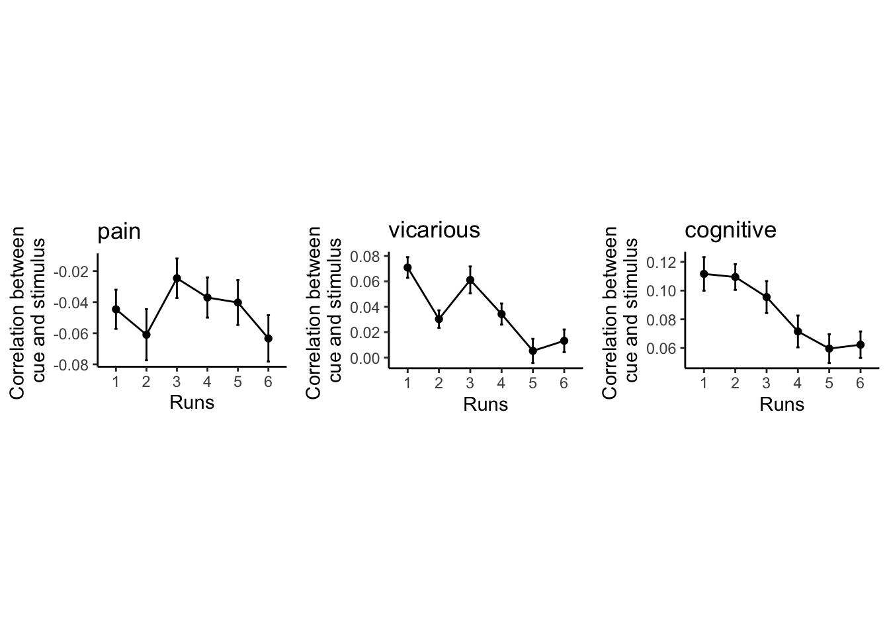

# [fMRI] Single trial correlation between cue and stim {#ch38_singletrial_corr}

```
author: "Heejung Jung"
date: "2023-03-04"
```

## What is the purpose of this notebook? {.unlisted .unnumbered}

* Identify the correlation between cue and stimulus phase single trial nifti files
* On discovery, I've calculated the correlation via script: `scripts/step10_nilearn/singletrialLSS/step07_corr_cue_stim.py`


```r
main_dir = dirname(dirname(getwd()))
main_dir = "/Users/h/Dropbox/projects_dropbox/social_influence_analysis"
analysis_dir = 
single_trial_dir = file.path(main_dir, 'analysis/fmri/nilearn/deriv04_corrcuestim')
```


## plot correlation (one-sample-t)


## Lineplot

```
## 
## Attaching package: 'ggpubr'
```

```
## The following object is masked from 'package:plyr':
## 
##     mutate
```




